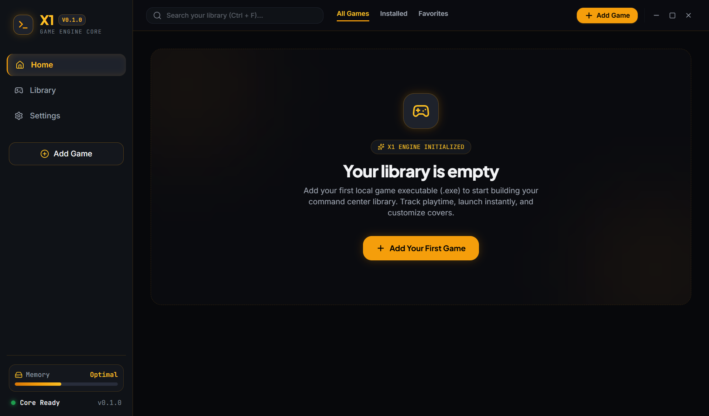
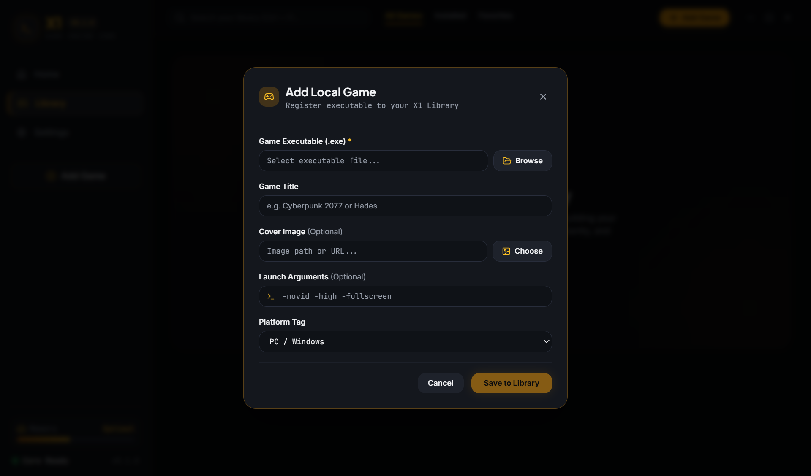
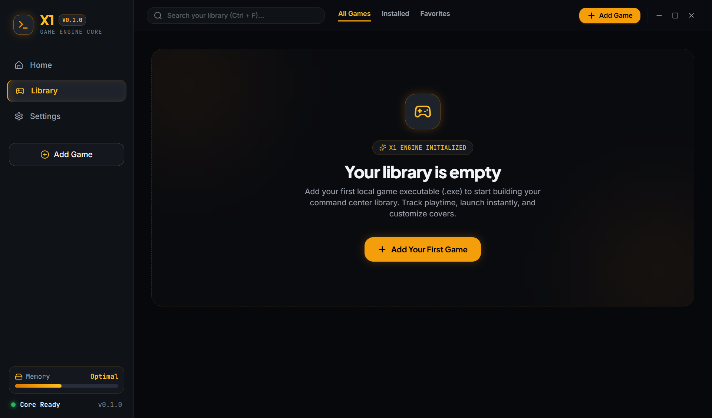

<div align="center">

  

  <p><strong>A modern, high-performance desktop command center for PC gamers and enthusiasts.</strong></p>

  <p>
    
    
    
    
    
    
  </p>

</div>

---

## 📸 Visual Showcase & Feature Walkthrough

### 1. Tactical Command Center & Hero Dashboard
> *Your central command station featuring live game telemetry, recently launched titles, and instant one-click launch controls.*

<div align="center">
  
</div>

- **Hero Banner Showcase:** Dynamically highlights your active or most recently played title with an immersive high-definition backdrop, total playtime logged, and relative last-played timestamps.
- **Active Process Monitor:** Real-time pulse indicator communicating running game state (`ACTIVE PROCESS`).
- **RAM & Hardware Telemetry:** The sidebar constantly tracks active memory utilization and available system headroom.

---

### 2. Automatic Game Identification & Metadata Detection
> *Zero-configuration cover detection. Simply point X1 Launcher to any `.exe` file, and it automatically extracts signals, identifies the title, and caches high-definition artwork locally.*

<div align="center">
  
</div>

#### How It Works:
1. **Multi-Signal Heuristic Extraction:**
   - **Executable Filename:** Analyzes the binary name (e.g., `eldenring.exe`), stripping build suffixes (`_x64`, `dx12`, `shipping`, etc.).
   - **Directory Hierarchy:** Intelligently bypasses generic subfolders (`bin`, `Win64`, `Game`, `Retail`) to isolate the true installation root.
   - **Windows PE Inspection:** Asynchronously inspects Windows `FileVersionInfo` (`ProductName` and `FileDescription`) via PowerShell with safety timeouts.
2. **Online Metadata Queries:**
   - Queries public game databases (Steam Store API out-of-the-box with optional Twitch/IGDB API key support).
3. **Interactive Confirmation Dialog:**
   - Displays detected cover art, developer, publisher, release date, and story synopsis before saving.
   - **Multiple Results Selection:** If sequels or editions exist (e.g., *Elden Ring Nightreign*, *Shadow of the Erdtree*), users can switch candidates with one click.
   - **Manual Search Fallback:** Obscure or custom executables can be searched manually or added without artwork using tactical placeholders.
4. **Local Cover Caching:**
   - Downloads artwork and stores it locally inside `AppData/Roaming/my-game-launcher/covers/` using safe filenames (e.g., `elden-ring.jpg`). Images load securely using the privileged `x1-media://` protocol.

---

### 3. Organized Game Library & Multi-Criteria Filtering
> *Manage hundreds of installed games in a tactical, responsive 3:4 grid.*

<div align="center">
  
</div>

- **Responsive Poster Grid:** 3:4 aspect ratio cards built with hover scrim overlays, playtime badges, and platform tags (`Steam Native`, `Epic Native`, `PC / Windows`).
- **Interactive Context Menu:**
  - **Change Artwork:** Search new online posters or upload a local image (`.png`, `.jpg`, `.webp`).
  - **Refresh Artwork:** Re-queries metadata databases for updated high-res assets.
  - **Find Artwork:** Quick one-click detector for legacy titles added without covers.
- **Global Search & Filter Tabs:**
  - Instant title search with `Ctrl + F` keyboard shortcut.
  - Filter by `All Games`, `Installed`, or `Favorites`.
  - Sort by *Recently Played*, *Alphabetical (A-Z)*, *Most Played*, or *Recently Added*.

---

## ⚡ Tech Stack & Architecture

```
my-game-launcher/
├── docs/
│   └── screenshots/           # Application screenshots for documentation
├── build/                     # Installer icons, entitlements & Windows resources
├── resources/                 # Application icons and unpacked media
├── src/
│   ├── main/
│   │   ├── index.ts               # Frameless BrowserWindow, x1-media protocol & lifecycle
│   │   ├── ipc/
│   │   │   ├── gameHandlers.ts    # Game launch, termination, and file dialogs
│   │   │   ├── metadataHandlers.ts# Game identification, metadata search & artwork caching
│   │   │   └── settingsHandlers.ts# Settings persistence & system telemetry
│   │   └── services/
│   │       ├── gameMetadataService.ts # Multi-signal heuristics, Steam & IGDB APIs
│   │       ├── artworkService.ts  # Local file downloader, slugifier & cache manager
│   │       ├── storageService.ts  # Persistent JSON database (userData/x1-launcher-data.json)
│   │       ├── gameService.ts     # Library business logic & artwork updating
│   │       └── processService.ts  # Safe process spawning & playtime tracking
│   ├── preload/
│   │   ├── index.ts               # contextBridge sandboxed bridge
│   │   └── index.d.ts             # Strongly typed Window.api declarations
│   └── renderer/src/
│       ├── components/            # Sidebar, TopBar, GameCard, AddGameModal, ArtworkModal
│       ├── pages/                 # Home, Library, Settings views
│       ├── services/              # launcherApi client wrapper
│       └── types/                 # Shared TypeScript models
└── electron-builder.yml       # Windows NSIS installer configuration
```

---

## 🔒 Security Architecture

1. **Strict Context Isolation:**
   - `webPreferences.contextIsolation: true`
   - `webPreferences.nodeIntegration: false`
   - Renderer processes have zero direct access to Node.js internals or shell execution.
2. **Safe Process Spawning:**
   - All game executables are spawned using `child_process.spawn` with an argument array and explicit `cwd`.
   - Never invokes shell wrappers (`cmd.exe /c` or `powershell.exe`) to prevent command injection.
   - Verifies absolute filesystem existence before triggering launch.
3. **Privileged Media Protocol:**
   - Local covers are loaded via a custom `x1-media://` protocol handler, completely avoiding unsafe `file:///` access in Chromium.

---

## 🚀 Getting Started

### Prerequisites
- Node.js 18+ (Node 22 recommended)
- npm or pnpm

### Installation
```bash
git clone https://github.com/MohdAkilAlam/X1_Game_Launcher.git
cd X1_Game_Launcher
npm install
```

### Development Server
Start the Electron application with live Hot Module Replacement (HMR):
```bash
npm run dev
```

### Type Checking
Run strict TypeScript verification for both Main and Renderer processes:
```bash
npm run typecheck
```

### Build Production Bundles
Compile the production Electron packages:
```bash
npm run build
```

### Create Windows Setup Installer
Generate a standalone `X1-Launcher-Setup.exe`:
```bash
npm run build:win
```
The installer executable will be generated inside the `dist/` directory.

---

## 📝 License
This project is licensed under the MIT License - see the [LICENSE](LICENSE) file for details.
